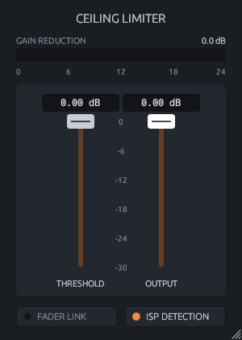

# Ceiling Limiter

A transparent look-ahead brickwall limiter for Linux, available as **CLAP** and **VST3**, with a
resizable GUI. Two faders do the work: pull **Threshold** down to make the track louder, and set
**Output** to the ceiling that peaks will never cross.



## Features

- **Threshold** (0 to -30 dB): drives the signal into the limiter.
- **Output** (0 to -30 dB): output ceiling.
- **Fader Link**: moving Threshold moves Output by the same amount, so you can judge the
  limiting at matched loudness.
- **ISP Detection**: limits inter-sample (true) peaks using 4x oversampled detection.
- **Gain reduction meter.**
- Shift-drag for fine adjustment, double-click to reset a fader, drag the lower-right corner
  to scale the window.
- Stereo-linked, about 1.5 ms look-ahead, latency reported to the host.

## Download

Get `ceiling-limiter-linux-x86_64.tar.gz` from the
[latest release](../../releases/latest), then:

```bash
tar -xzf ceiling-limiter-linux-x86_64.tar.gz
mkdir -p ~/.clap ~/.vst3
cp -r "Ceiling Limiter.clap" ~/.clap/
cp -r "Ceiling Limiter.vst3" ~/.vst3/
```

Rescan plugins in your host.

## Building from source

On Linux, `./build-linux.sh` installs dependencies and Rust, runs the tests, builds, and
installs the plugin to `~/.clap` and `~/.vst3`.

Manual build: `cargo xtask bundle ceiling_limiter --release` (output in `target/bundled/`).
Standalone test app: `cargo run --release --features standalone`.

## License

GPL-3.0-or-later. Built with [NIH-plug](https://github.com/robbert-vdh/nih-plug).
